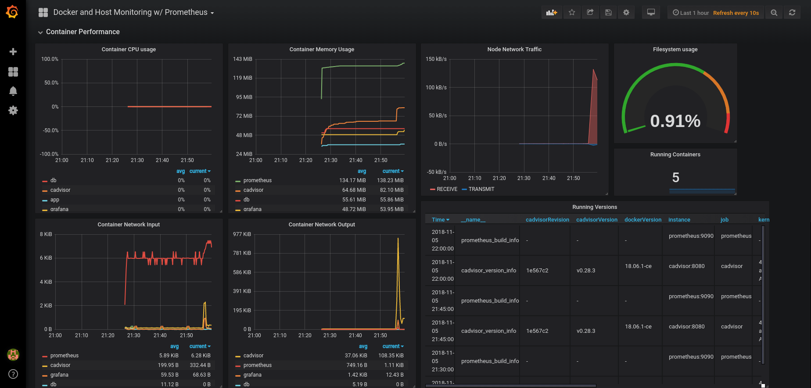
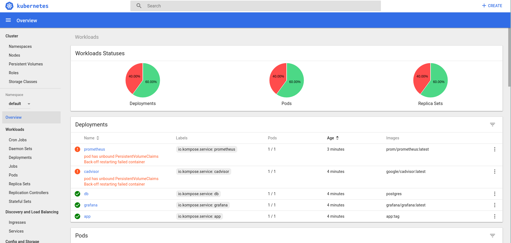

## [Processo e Sviluppo del Software] - Assignment 1

# Super Extreme Cool Search for Scientific Articles


Super Extreme Cool Search for Scientific Articles is a simple distributed application allowing for the search of articles against a database.

The core of the application is built on `node.js`, interfacing a `postgresql` database for data management.

## Authors

* **Federico Bottoni** - *806944* 
* **Nassim Habbash** - *808292* 


## Getting Started

```
$ git clone https://gitlab.com/FedericoBottoni/pss-assignment1 
$ cd pss-assignment1
```

## Architecture

The application consists of three main components:

* **front-end**: through which a user is able to query the database through API calls
* **back-end**: which manages servicing the API and querying the DB
* **database**: storing the articles data

## DevOps

We tried to address 4 aspects of the DevOps toolchain for the given assignment. These are:

* Containerization
* Provisioning
* Continuous Integration
* Monitoring

## Containerization

We used Docker and Docker Compose to implement our application as a multi-containerized one. The process generates 5 containers: `app` and `db` are the main containers which constitute the application, while `prometheus`, `cadvisor` and `grafana` are used for monitoring.

To get the application started with `docker-compose`:

```
$ docker-compose up --build
$ docker-compose ps

   Name                 Command               State           Ports         
----------------------------------------------------------------------------
app          npm start                        Up      0.0.0.0:1010->1010/tcp
cadvisor     /usr/bin/cadvisor -logtostderr   Up      0.0.0.0:7070->8080/tcp
db           docker-entrypoint.sh postgres    Up      0.0.0.0:5432->5432/tcp
grafana      /run.sh                          Up      0.0.0.0:3000->3000/tcp
prometheus   /bin/prometheus --config.f ...   Up      0.0.0.0:9090->9090/tcp

```

## Monitoring

For monitoring we used Prometheus, Grafana and cAdvisor.

cAdvisor analyzes and exposes usage and performance data from running container, exposing to Prometheus these metrics - it is to all effects an exporter from third-party system metric to Prometheus metrics. 

Prometheus is then able to scrape them, and service them to Grafana, which queries the Prometheus container and is able to give to the user a customizable dashboard to show graphs and the necessary info an admin would need.

The configuration for these monitoring tools is given in the `docker-compose.yml` and the `prometheus/prometheus.yml` files.

This is what the final Grafana dashboard looks like, when the system is correctly running.



## Provisioning

Our tool of choice is Kubernetes.

To address provisioning we have tried different alternatives.

We tried to deploy our application to the Kubernetes cluster hosted by GARR Cloud, to no avail. Unfortunately the short term of the assignment and the concomitance of the All Saints' Day holidays slowed significantly our communication with the GARR assistance to correctly register and authorize us to access the shared cluster.

We have thus decided to deploy our application using Minikube. Minikube is a tool that allows to run a single-node Kubernetes cluster inside a VM on a local machine.

Inside the `k8s\` folder we have provided the configuration for every container, in the form of `service+deployment+volume`.


```
$ minikube start //may take a while...
$ eval $(minikube docker-env) //this is to use the local Docker daemon and use local images
$ kubectl create -f k8s/
$ kubectl get pods
NAME                          READY   STATUS    RESTARTS   AGE
app-7f54fd667b-bf6mr          1/1     Running   0          1m
cadvisor-847c8b697f-dk46j     0/1     Error     2          1m
db-8b97b649d-ppz9n            1/1     Running   0          1m
grafana-5ccb74444f-9r8vd      1/1     Running   0          1m
prometheus-78d56c69bd-4qnv7   0/1     Error     2          1m
```

Unfortunately, we haven't been able to launch our Prometheus and cAdvisor monitoring pods into the Kubernetes cluster. Issues with the persistency of the volumes caused the pods to cease running. More in-depth study of the technology and troubleshooting were needed to solve the presented issues, but we didn't have the time to tackle them. 

Executing `minikube dashboard` from the terminal lets us access the dashboard from the browser, to check eventual details on the status of the cluster.




## Continuous Integration/Continuous Deployment

TODO

## Conclusions

The project was deeply interesting, and provided us with the opportunity to learn and study about the technology representing the state of the art of the DevOps ecosystem. 
Due to work and Bachelor of CS final test we didn't have enough resources to commit to the project, but we expect that with enough time we could've addressed some issues better.

Future developments may include:
* Deploying the application to a Kubernetes cluster on a Cloud (GARR, Google Cloud Platform, AWS)
* Integrating different Exporters to Prometheus to add different kind of metrics to the system (PostgreSQL metrics, etc)
* Adding to our DevOps chain a Configuration management tool

